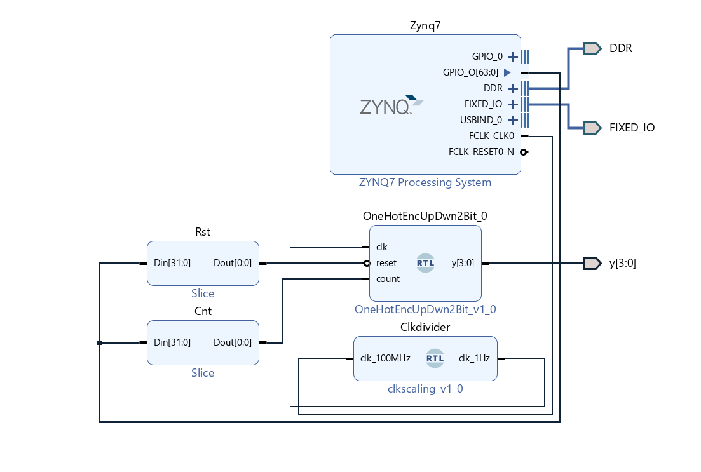
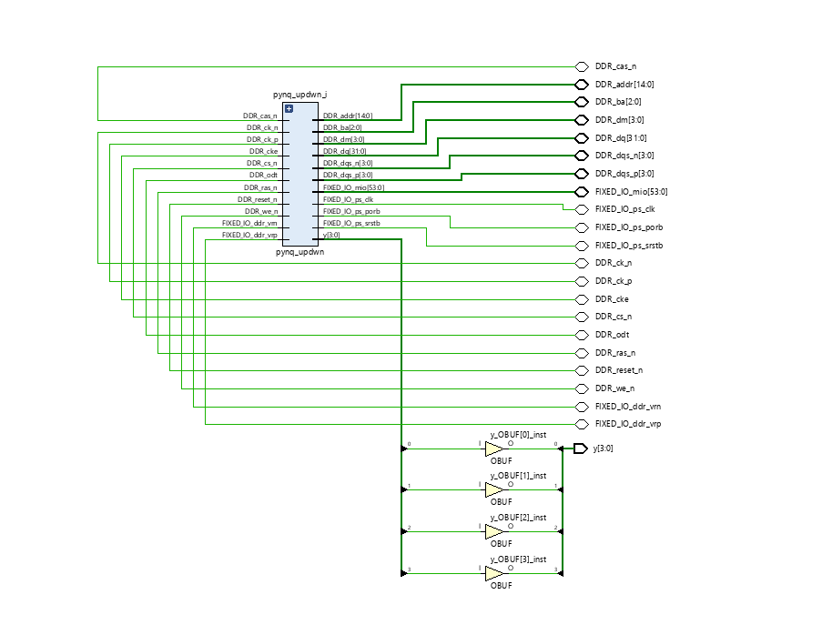
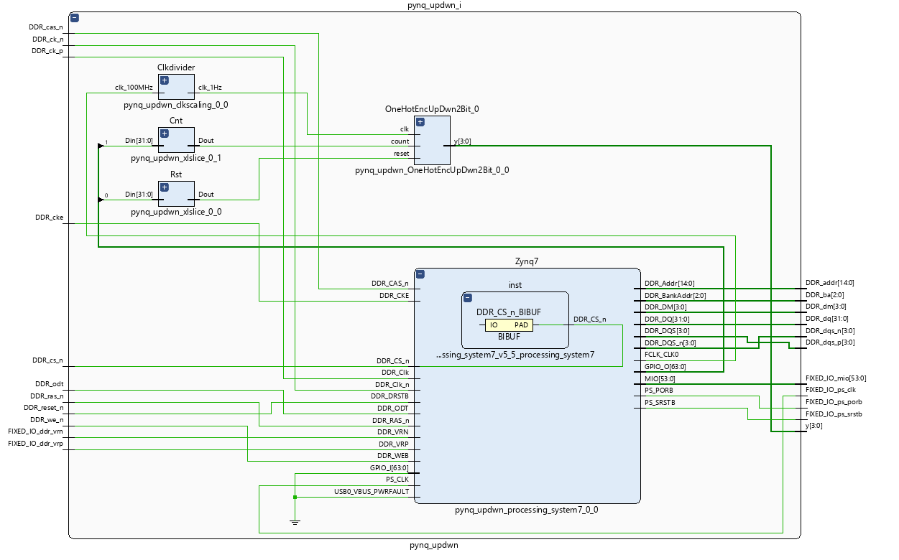
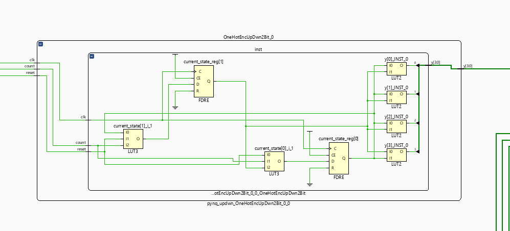
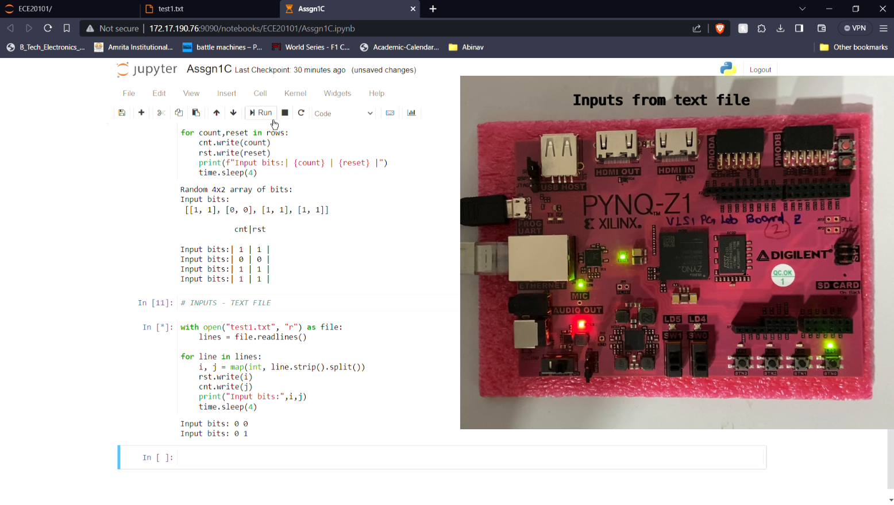

# Part C: Design using FPGA with a hardware-software approach

### Synthesize the up-down counter on an FPGA and simulate using test vectors generated from the ARM processor.

For further details on the implementation logic, refer to the Verilog design in **Part B/main.v**. This file contains the detailed RTL code for the up-down counter, including the module definition and functional behavior.

> *Reference: See Part B, `main.v` for the up-down counter implementation.*

Also, For further guidance on setting up the PYNQ Z1 board, refer to the official documentation:
[PYNQ Z1 Setup Guide](https://pynq.readthedocs.io/en/latest/getting_started/pynq_z1_setup.html).

### IP Block for up-down counter using one-hot encoding technique. 

### RTL schematic 

the below image gives a detialed view of the pynq_updwn block 

detailed view of the OneHotEncUpDwn2Bit_0 block

### outputs 
inputs given via jupyter notebook and output is observed in pynq board

